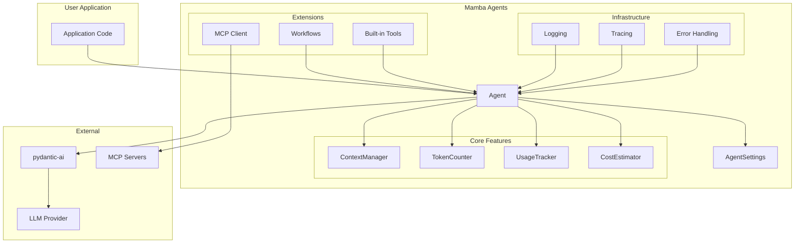
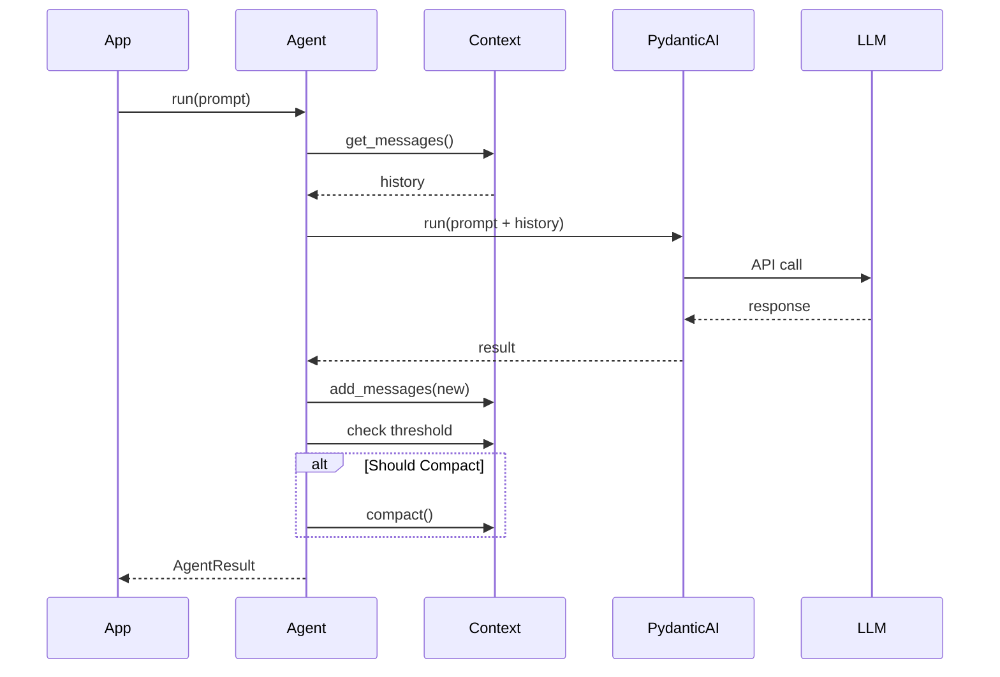
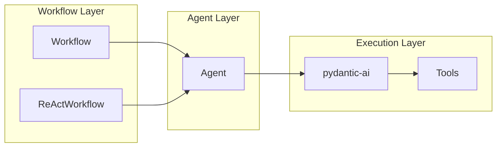

# Architecture Overview

Mamba Agents is a thin wrapper around pydantic-ai that adds enterprise-grade infrastructure.

## High-Level Architecture



## Module Structure

```
src/mamba_agents/
├── agent/           # Core agent (wraps pydantic-ai)
│   ├── core.py      # Agent class
│   ├── config.py    # AgentConfig
│   └── result.py    # AgentResult
│
├── config/          # Configuration system
│   ├── settings.py  # AgentSettings (root)
│   ├── model_backend.py
│   ├── logging_config.py
│   └── ...
│
├── context/         # Context window management
│   ├── manager.py   # ContextManager
│   ├── config.py    # CompactionConfig
│   └── compaction/  # 5 strategies
│
├── tokens/          # Token counting & cost
│   ├── counter.py   # TokenCounter
│   ├── tracker.py   # UsageTracker
│   └── cost.py      # CostEstimator
│
├── workflows/       # Workflow orchestration
│   ├── base.py      # Workflow ABC
│   ├── config.py    # WorkflowConfig
│   └── react/       # ReAct implementation
│
├── tools/           # Built-in tools
│   ├── filesystem/  # File operations
│   ├── bash.py      # Shell commands
│   ├── glob.py      # Pattern matching
│   └── grep.py      # Content search
│
├── mcp/             # MCP integration
│   ├── client.py    # MCPClientManager
│   └── config.py    # MCPServerConfig
│
├── backends/        # Model backends
│   ├── openai_compat.py
│   └── profiles.py
│
├── observability/   # Logging & tracing
│   ├── logging.py
│   ├── tracing.py
│   └── otel.py
│
└── errors/          # Error handling
    ├── exceptions.py
    ├── circuit_breaker.py
    └── retry.py
```

## Component Relationships

### Agent Core

The `Agent` class is the central component:

```python
class Agent[DepsT, OutputT]:
    # Delegates to pydantic-ai
    _agent: PydanticAgent

    # Manages context
    context_manager: ContextManager | None

    # Tracks tokens
    token_counter: TokenCounter
    usage_tracker: UsageTracker
    cost_estimator: CostEstimator

    # Configuration
    config: AgentConfig
    settings: AgentSettings
```

### Context Flow



### Workflow Orchestration



## Design Principles

### 1. Thin Wrapper

Mamba Agents doesn't reinvent pydantic-ai; it extends it:

- Core agent logic delegates to pydantic-ai
- Infrastructure layers are composable
- Components work standalone or integrated

### 2. Configuration Layering

Multiple configuration sources with clear priority:

```python
# Priority: constructor > env > .env > file > default
settings = AgentSettings()  # Loads from all sources
agent = Agent("gpt-4o", settings=settings)  # Constructor overrides
```

### 3. Facade Pattern

Agent provides a simplified interface to complex subsystems:

```python
# Instead of:
counter = TokenCounter()
tracker = UsageTracker()
count = counter.count(text)
tracker.record_usage(...)

# Just use:
agent.get_token_count(text)
agent.get_usage()
```

### 4. Strategy Pattern

Interchangeable algorithms for compaction:

```python
# Same interface, different strategies
config = CompactionConfig(strategy="sliding_window")
config = CompactionConfig(strategy="summarize_older")
config = CompactionConfig(strategy="hybrid")
```

### 5. Hooks for Extensibility

Observable lifecycle events:

```python
hooks = WorkflowHooks(
    on_step_start=my_logger,
    on_step_complete=my_metrics,
)
```

## Data Flow

### Request Lifecycle

1. **Input** - User provides prompt
2. **Context** - Messages retrieved from history
3. **Execution** - pydantic-ai runs with tools
4. **Tracking** - Usage recorded
5. **Storage** - New messages added to context
6. **Compaction** - Context pruned if needed
7. **Output** - Result returned to user

### Token Tracking Flow

```
Agent.run()
  → pydantic-ai execution
  → Extract usage from response
  → UsageTracker.record_usage()
  → CostEstimator.estimate()
  → TokenUsage/CostBreakdown available
```

## Extension Points

### Custom Tools

```python
@agent.tool
def my_tool(param: str) -> str:
    return "result"
```

### Custom Workflows

```python
class MyWorkflow(Workflow[None, str, dict]):
    @property
    def name(self) -> str:
        return "my_workflow"

    async def _execute(self, prompt, state, deps):
        # Custom logic
        pass
```

### Custom Compaction

```python
class MyStrategy(CompactionStrategy):
    def compact(self, messages, config):
        # Custom compaction logic
        pass
```
