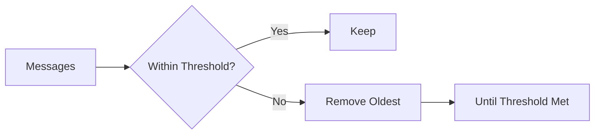
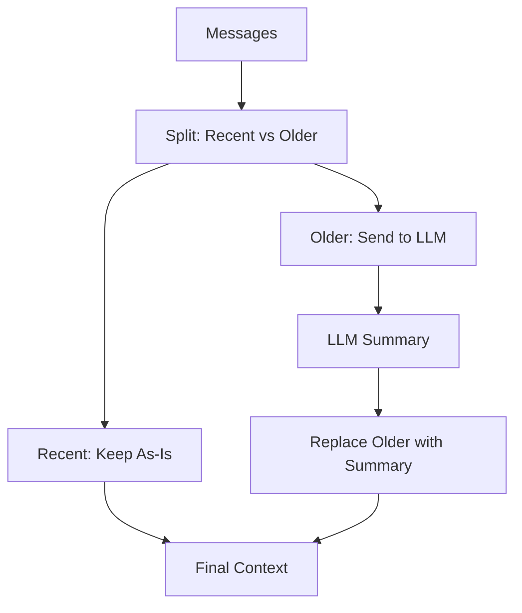
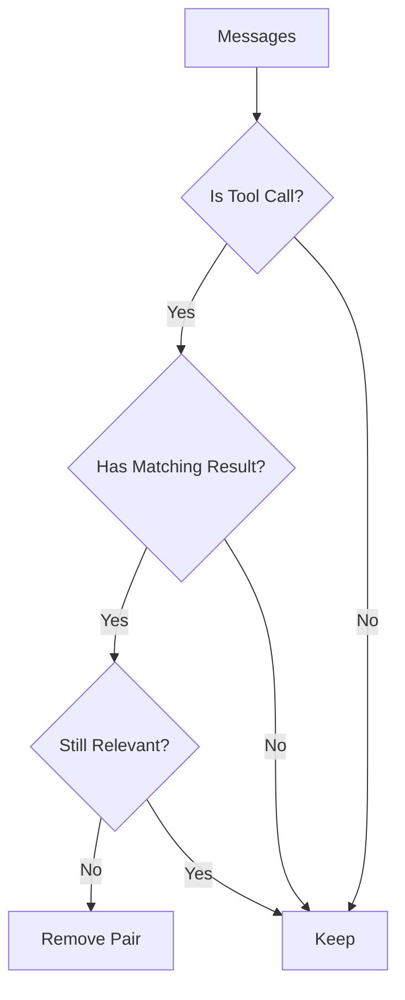
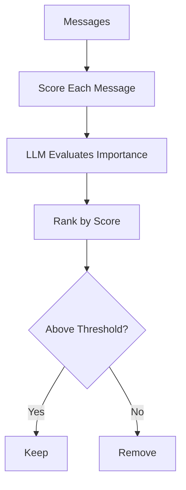
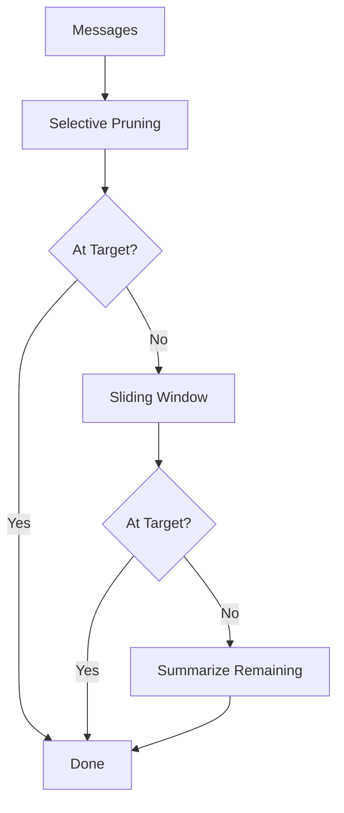
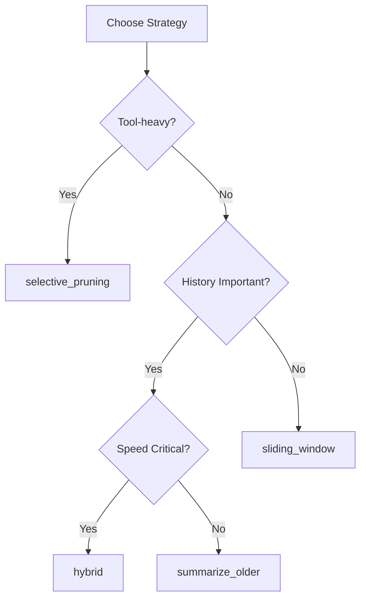

# Context Compaction Strategies

Deep dive into the 5 compaction strategies available in Mamba Agents.

## Overview

As conversations grow, context windows fill up. Compaction strategies manage this by intelligently reducing message history while preserving important information.

## Strategy Comparison

| Strategy | Speed | Quality | Best For |
|----------|-------|---------|----------|
| `sliding_window` | Fast | Basic | Simple chats |
| `summarize_older` | Slow | High | Long research |
| `selective_pruning` | Fast | Good | Tool-heavy work |
| `importance_scoring` | Slow | High | Mixed content |
| `hybrid` | Medium | High | General use |

## 1. Sliding Window

Removes oldest messages beyond a threshold.

### How It Works



### Configuration

```python
from mamba_agents import CompactionConfig

config = CompactionConfig(
    strategy="sliding_window",
    trigger_threshold_tokens=100000,
    target_tokens=80000,
    preserve_recent_turns=10,
    preserve_system_prompt=True,
)
```

### Behavior

- **Keeps**: System prompt + N most recent turns
- **Removes**: Oldest messages until target reached
- **Speed**: Very fast (no LLM calls)

### Best For

- Chat applications
- When recent context is most important
- High-volume, fast conversations

### Example

```
Before: [sys, m1, m2, m3, m4, m5, m6, m7, m8, m9, m10]
After:  [sys, m6, m7, m8, m9, m10]  # Kept last 5 turns
```

## 2. Summarize Older

Uses an LLM to summarize older messages.

### How It Works



### Configuration

```python
config = CompactionConfig(
    strategy="summarize_older",
    preserve_recent_turns=5,
    summarization_model="gpt-4o-mini",  # Or "same" for current model
)
```

### Behavior

- **Keeps**: System prompt + recent turns + summary
- **Summarizes**: All messages before recent turns
- **Speed**: Slower (requires LLM call)

### Best For

- Research and analysis tasks
- When historical context matters
- Long-running conversations

### Example

```
Before: [sys, m1, m2, m3, m4, m5, m6, m7, m8]
After:  [sys, summary("m1-m5"), m6, m7, m8]
```

## 3. Selective Pruning

Removes completed tool call/result pairs.

### How It Works



### Configuration

```python
config = CompactionConfig(
    strategy="selective_pruning",
    preserve_recent_turns=3,
)
```

### Behavior

- **Keeps**: All non-tool messages + recent tool calls
- **Removes**: Old tool call/result pairs
- **Speed**: Fast (pattern matching)

### Best For

- Tool-heavy workflows
- Coding assistants
- When tool results become stale

### Example

```
Before: [sys, user, tool_call:read_file, tool_result:content, assistant, ...]
After:  [sys, user, assistant, ...]  # Tool pair removed
```

## 4. Importance Scoring

Uses LLM to score and prune least important messages.

### How It Works



### Configuration

```python
config = CompactionConfig(
    strategy="importance_scoring",
    preserve_recent_turns=3,
)
```

### Behavior

- **Scores**: Each message for relevance
- **Keeps**: High-importance messages
- **Removes**: Low-importance messages
- **Speed**: Slowest (multiple LLM calls)

### Best For

- Complex conversations with varying importance
- When you can't lose any critical info
- Quality over speed

### Example

```
Scores: [sys:1.0, m1:0.3, m2:0.9, m3:0.2, m4:0.8, m5:0.1]
After:  [sys, m2, m4]  # Kept high-scoring messages
```

## 5. Hybrid

Combines multiple strategies in sequence.

### How It Works



### Configuration

```python
config = CompactionConfig(
    strategy="hybrid",
    preserve_recent_turns=5,
)
```

### Behavior

1. First: Remove old tool pairs (fast)
2. Then: Apply sliding window (fast)
3. Finally: Summarize if still over (slow)

### Best For

- General-purpose use
- Unknown conversation patterns
- Balance of speed and quality

## Choosing a Strategy

### Decision Tree



### By Use Case

| Use Case | Recommended |
|----------|-------------|
| Chatbot | `sliding_window` |
| Code assistant | `selective_pruning` |
| Research agent | `summarize_older` |
| General assistant | `hybrid` |
| Complex analysis | `importance_scoring` |

## Configuration Options

### Common Options

| Option | Type | Default | Description |
|--------|------|---------|-------------|
| `strategy` | str | `"sliding_window"` | Strategy name |
| `trigger_threshold_tokens` | int | 100000 | When to compact |
| `target_tokens` | int | 80000 | Target after compaction |
| `preserve_recent_turns` | int | 10 | Always keep N recent |
| `preserve_system_prompt` | bool | True | Always keep system |

### Strategy-Specific

| Option | Strategy | Description |
|--------|----------|-------------|
| `summarization_model` | summarize_older | Model for summaries |

## Performance Impact

### Token Savings

```python
# Before compaction
state = agent.get_context_state()
print(f"Before: {state.token_count} tokens")

# After compaction
result = await agent.compact()
print(f"After: {result.tokens_after} tokens")
print(f"Saved: {result.tokens_before - result.tokens_after} tokens")
```

### Cost Implications

- **sliding_window**: No additional cost
- **selective_pruning**: No additional cost
- **summarize_older**: Cost of summary generation
- **importance_scoring**: Cost of scoring calls
- **hybrid**: Variable based on what's needed

## Custom Strategies

Implement your own strategy:

```python
from mamba_agents.context.compaction import CompactionStrategy

class MyStrategy(CompactionStrategy):
    def compact(self, messages, config):
        # Your compaction logic
        return compacted_messages, removed_count
```
