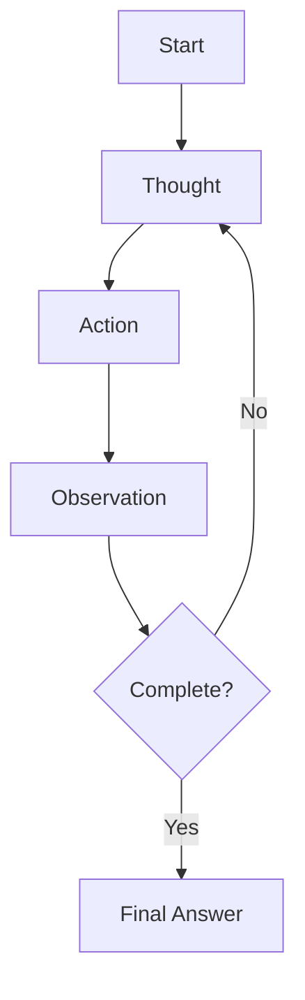
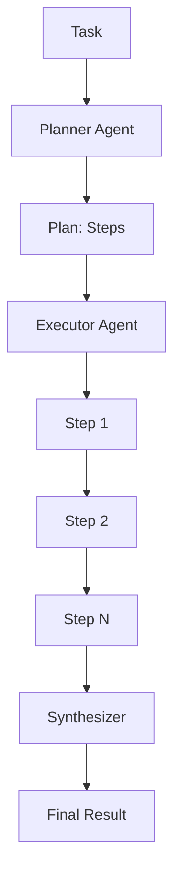
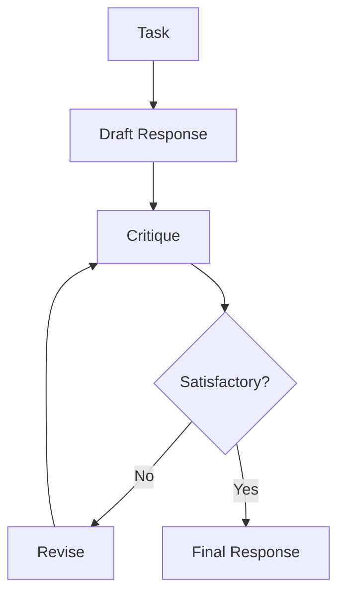
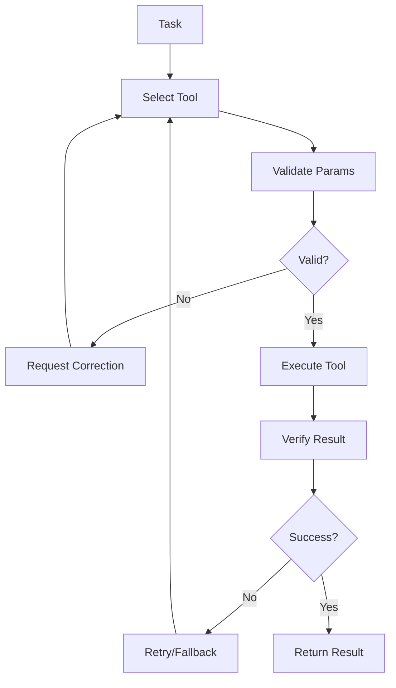
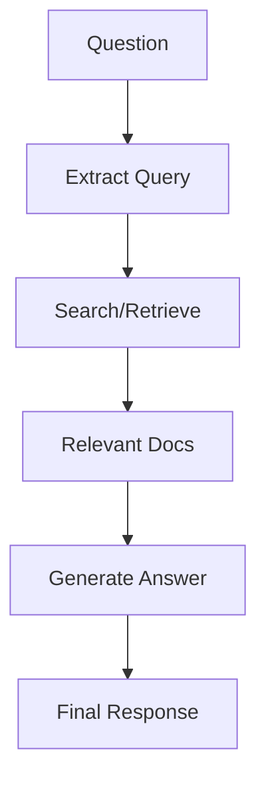

# Workflow Patterns

Design patterns for orchestrating multi-step agent execution.

## Overview

Workflows extend agents beyond single-turn interactions:

- **Multi-step execution** - Chain multiple agent calls
- **Iterative refinement** - Loop until goals achieved
- **State tracking** - Monitor progress and results
- **Error recovery** - Handle failures gracefully

## Pattern 1: ReAct (Reasoning and Acting)

The built-in ReAct workflow implements iterative reasoning.

### Concept

```
THOUGHT: I need to find the bug
ACTION: read_file("src/main.py")
OBSERVATION: [file contents]
THOUGHT: I see an issue on line 42
ACTION: final_answer("The bug is...")
```

### Flow



### Implementation

```python
from mamba_agents import Agent
from mamba_agents.workflows import ReActWorkflow, ReActConfig

agent = Agent("gpt-4o", tools=[read_file, run_bash])
workflow = ReActWorkflow(agent=agent, config=ReActConfig(max_iterations=15))

result = await workflow.run("Find and fix the bug in main.py")
```

### Best For

- Open-ended tasks requiring exploration
- Debugging and analysis
- Research tasks

## Pattern 2: Plan-Execute

Separate planning from execution for complex tasks.

### Concept

```
PLAN: [step1, step2, step3]
EXECUTE: step1 → result1
EXECUTE: step2 → result2
EXECUTE: step3 → result3
SYNTHESIZE: final answer
```

### Flow



### Implementation

```python
from mamba_agents import Agent, Workflow, WorkflowConfig, WorkflowState

class PlanExecuteWorkflow(Workflow[None, str, dict]):
    def __init__(self, planner: Agent, executor: Agent, config=None):
        super().__init__(config=config)
        self.planner = planner
        self.executor = executor

    @property
    def name(self) -> str:
        return "plan_execute"

    def _create_initial_state(self, prompt: str) -> WorkflowState[dict]:
        return WorkflowState(context={"prompt": prompt, "plan": [], "results": []})

    async def _execute(self, prompt, state, deps=None):
        # Phase 1: Plan
        plan_result = await self.planner.run(f"Create a plan for: {prompt}")
        state.context["plan"] = plan_result.output.split("\n")

        # Phase 2: Execute each step
        for step in state.context["plan"]:
            result = await self.executor.run(step)
            state.context["results"].append(result.output)

        # Phase 3: Synthesize
        synthesis = await self.planner.run(
            f"Summarize results: {state.context['results']}"
        )
        return synthesis.output
```

### Best For

- Complex multi-step tasks
- When order matters
- Predictable execution paths

## Pattern 3: Reflection

Self-critique and improvement loop.

### Concept

```
DRAFT: initial response
CRITIQUE: identify weaknesses
REVISE: improve based on critique
REPEAT: until satisfactory
```

### Flow



### Implementation

```python
class ReflectionWorkflow(Workflow[None, str, dict]):
    def __init__(self, agent: Agent, max_revisions: int = 3, config=None):
        super().__init__(config=config)
        self.agent = agent
        self.max_revisions = max_revisions

    async def _execute(self, prompt, state, deps=None):
        # Initial draft
        draft = await self.agent.run(f"Respond to: {prompt}")
        state.context["draft"] = draft.output

        for i in range(self.max_revisions):
            # Critique
            critique = await self.agent.run(
                f"Critique this response:\n{state.context['draft']}"
            )

            # Check if satisfactory
            if "no improvements needed" in critique.output.lower():
                break

            # Revise
            revision = await self.agent.run(
                f"Improve based on critique:\n{critique.output}\n\n"
                f"Original:\n{state.context['draft']}"
            )
            state.context["draft"] = revision.output

        return state.context["draft"]
```

### Best For

- Quality-critical outputs
- Writing and content creation
- Code review

## Pattern 4: Tool Use

Structured tool calling with validation.

### Concept

```
DECIDE: which tool to use
VALIDATE: check parameters
EXECUTE: call the tool
VERIFY: check result
```

### Flow



### Best For

- Reliable tool execution
- API integrations
- Data processing pipelines

## Pattern 5: Retrieval-Augmented

Combine retrieval with generation.

### Concept

```
QUERY: extract search terms
RETRIEVE: fetch relevant documents
GENERATE: answer using context
```

### Flow



### Implementation

```python
class RAGWorkflow(Workflow[None, str, dict]):
    def __init__(self, agent: Agent, retriever, config=None):
        super().__init__(config=config)
        self.agent = agent
        self.retriever = retriever

    async def _execute(self, prompt, state, deps=None):
        # Retrieve relevant documents
        docs = await self.retriever.search(prompt)
        context = "\n".join(doc.content for doc in docs)

        # Generate with context
        result = await self.agent.run(
            f"Context:\n{context}\n\nQuestion: {prompt}"
        )
        return result.output
```

### Best For

- Question answering
- Knowledge-based tasks
- Documentation queries

## Combining Patterns

### ReAct + Reflection

```python
class ReActWithReflection(Workflow):
    async def _execute(self, prompt, state, deps):
        # ReAct phase
        react_result = await self.react_workflow.run(prompt)

        # Reflection phase
        critique = await self.agent.run(f"Critique: {react_result.output}")

        if needs_improvement(critique):
            return await self.react_workflow.run(
                f"Improve based on: {critique.output}"
            )

        return react_result.output
```

### Plan-Execute + Tool Use

```python
class PlanWithToolValidation(Workflow):
    async def _execute(self, prompt, state, deps):
        plan = await self.planner.run(prompt)

        for step in plan.steps:
            # Validate tool call
            if not self.validate_tool(step):
                step = await self.fix_tool_call(step)

            result = await self.executor.run(step)
            # Continue...
```

## Choosing a Pattern

| Task Type | Recommended Pattern |
|-----------|---------------------|
| Open exploration | ReAct |
| Structured tasks | Plan-Execute |
| Quality output | Reflection |
| API integration | Tool Use |
| Knowledge queries | RAG |
| Complex tasks | Combine patterns |

## Implementation Tips

### 1. Set Clear Termination Conditions

```python
config = WorkflowConfig(
    max_iterations=15,
    timeout_seconds=300,
)
```

### 2. Use Hooks for Monitoring

```python
hooks = WorkflowHooks(
    on_step_complete=lambda s, step: log_step(step),
)
```

### 3. Handle Failures Gracefully

```python
try:
    result = await workflow.run(task)
except WorkflowError as e:
    if e.partial_result:
        return e.partial_result
    raise
```

### 4. Track Costs

```python
result = await workflow.run(task)
print(f"Workflow cost: ${workflow.get_cost():.4f}")
```
